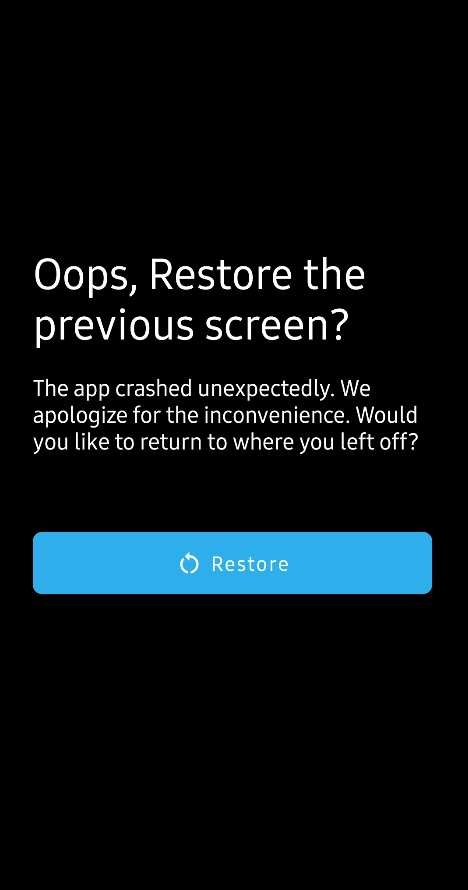
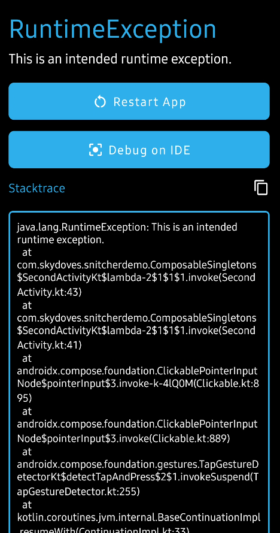

<h1 align="center">Snitcher</h1></br>

<p align="center">
  <a href="https://opensource.org/licenses/Apache-2.0"></a>
  <a href="https://android-arsenal.com/api?level=21"></a>
  <a href="https://github.com/skydoves/snitcher/actions/workflows/android.yml"></a>
  <a href="https://github.com/skydoves"></a>
</p><br>

<p align="center">
🦉 Snitcher captures global crashes, enabling easy redirection to the exception tracing screen for swift recovery.
</p><br>

<p align="center">


</p>

## What is Snitcher?

Snitcher offers versatile advantages such as aiding in debugging crashes during development, facilitating easy sharing of exceptions by your QA team, enhancing user experiences with recovery screens instead of abrupt closures, and enabling global exception tracing and customized launch behaviors tailored to your specific needs. You have the complete freedom to customize the crash tracing screens according to your build types and preferences, reporting to the Firebase's Crashlytics with displaying the exception screen, including options like launching a designated Activity, sending messages to your BroadcastReceiver, or any other desired actions.

## Documentation

For comprehensive details about Snitcher, please refer to the **[complete documentation available here](https://skydoves.github.io/snitcher/)**.

## Download

[](https://search.maven.org/search?q=g:%22com.github.skydoves%22%20AND%20a:%22snitcher%22)

### Gradle

Add the dependency below to your **module**'s `build.gradle` file:

```gradle
dependencies {
    implementation "com.github.skydoves:snitcher:1.0.0"
}
```

## Usage

Installing Snitcher is a breeze; it hooks into global exceptions, replacing application closure with informative exception tracing screens. You can seamlessly install Snitcher using the following example:

```kotlin
class App : Application() {

  override fun onCreate() {
    super.onCreate()

    Snitcher.install(application = this)
  }
}
```

It's recommended to install Snitcher on your **Application** class or your on initialization solution, such as [App Startup](https://developer.android.com/topic/libraries/app-startup).

### Tracing Global Exceptions

You can trace the global exceptions by providing `exceptionHandler` lambd parameter. This can be highly beneficial if you intend to gather and report exceptions to other platforms, such as [Firebase Crashlyrics](https://firebase.google.com/docs/crashlytics).

```kotlin
Snitcher.install(
  application = this,
  exceptionHandler = { exception: SnitcherException ->
    Firebase.crashlytics.log(exception.stackTrace) // or exception.message, 
  }
)
```

The `exceptionHandler` gives you `SnitcherException`, encompassing the exception message, stack traces, package name, and thread information. Additionally, it enables you to recover the original `Throwable` instance with the `SnitcherException.throwable` extension.

```kotlin
Snitcher.install(
  application = this,
  exceptionHandler = { exception: SnitcherException ->
    val message: String = exception.message
    val stackTrace: String = exception.stackTrace
    val throwable: Throwable = exception.throwable
    val threadName: String = exception.threadName

    // do somethings
  }
)
```

### Custom Exception Trace Screen

Snitcher provides ready-to-use exception tracing screens (such as `ExceptionTraceActivity`, built with the `ExceptionTraceScreen` Composable), giving you the flexibility to extensively tailor these screens according to your preferences, and even design your own distinct tracing interfaces. 

```kotlin
Snitcher.install(
  application = this,
  traceActivity = ExceptionTraceActivity::class
)
```

If you don't specify the `traceActivity` parameter, the default value will be `ExceptionTraceActivity`. You can tailor the launched activity by modifying the `traceActivity` parameter to match your preferred choice. The example below demonstrates the construction of a customized trace Activity:

```kotlin
class MyExceptionTraceActivity : ComponentActivity() {

  override fun onCreate(savedInstanceState: Bundle?) {
    super.onCreate(savedInstanceState)

    setContent {
      val exception by Snitcher.exception.collectAsState()
      val launcher by Snitcher.launcher.collectAsState()

      SnitcherTheme {
        if (exception != null) {
          if (BuildConfig.DEBUG) {
            // implement your own exception trace screen
            ExceptionTraceScreen(
              launcher = launcher,
              snitcherException = exception!!,
            )
          } else {
            // implement your own app restore screen
            AppRestoreScreen(launcher = launcher)
          }
        }
      }
    }
  }
}
```

As demonstrated in the example above, Snitcher provides access to the `SnitcherException` and the package name of the launcher Activity. This information can be utilized to construct highly customized trace screens that align with your specific needs. Snitcher conveniently provides this information through [StateFlow](https://kotlinlang.org/api/kotlinx.coroutines/kotlinx-coroutines-core/kotlinx.coroutines.flow/-state-flow/)s, allowing you to observe these values without the need for cumbersome intent handling when initiating the trace Activity.

```kotlin
val exception: SnitcherException? by Snitcher.exception.collectAsState()
val launcher: String by Snitcher.launcher.collectAsState()
```

> **Note**: Following any app crashes, you can readily observe the exception details across various components at any time and from any location.

### Custom Launcher (Restore) Activity

Furthermore, you can customize the launcher (restore activity), specifying which Activity should be executed upon restoration within the trace activity. If you don't specify a `launcher` activity, the most recent Activity that encountered a crash will automatically be launched when users press the 'restore' button. However, if you wish to launch a particular Activity instead of the most recent one, you can accomplish this by providing the launcher parameter:

```kotlin
Snitcher.install(
  application = this,
  launcher = MainActivity::class,
)
```

### Custom Snitcher Theme

If you just want to use the pre-builts sreens, but want to customize those components, such as colors and strings, you can easily accomplish it by giving a copy of `SnitcherColor` to the `SnitcherTheme`:

```kotlin
SnitcherTheme(
  colors = SnitcherTheme.colors.copy(
    primary = Color.Blue,
    background = Color.White,
    textHighEmphasis = Color.Black
  )
) {
  if (exception != null) {
    ExceptionTraceScreen(
      launcher = launcher,
      snitcherException = exception!!,
    )
  }
}
```

If you wish to personalize the text strings within the pre-built UIs, you can override the following string values within your `strings.xml` file:

```xml
<string name="snitcher_release_crash_screen_title">Oops, Restore the previous screen?</string>
<string name="snitcher_release_crash_screen_description">The app crashed unexpectedly. We apologize for the inconvenience. Would you like to return to where you left off?</string>
<string name="snitcher_release_crash_screen_restore">Restore</string>
<string name="snitcher_debug_crash_screen_restore">Restore App</string>
<string name="snitcher_debug_crash_screen_debug_on_ide">Debug on IDE</string>
<string name="snitcher_debug_crash_screen_stacktrace">Stacktrace</string>
```

### Custom Build Types

If you intend to launch distinct trace activities and implement different behaviors or flavors, you can install Snitcher based on specific build types, as shown in the example below:

```kotlin
Snitcher.install(
  application = this,
  traceActivity = if (BuildConfig.DEBUG) {
    MyExceptionTraceActivity::class
  } else {
    traceActivity = RestoreActivity::class,
  },
  exceptionHandler = {
    if (!BuildConfig.DEBUG) {
      Firebase.crashlytics.log(exception.stackTrace)
    }
  }
)
```

Alternatively, you can create a single trace Activity and manage the different build types within the activity itself, as demonstrated in the example below:

```kotlin
Snitcher.install(
  application = this,
  launcher = MyExceptionTraceActivity::class,
)

class MyExceptionTraceActivity : ComponentActivity() {

  override fun onCreate(savedInstanceState: Bundle?) {
    super.onCreate(savedInstanceState)

    setContent {
      val exception by Snitcher.exception.collectAsState()
      val launcher by Snitcher.launcher.collectAsState()

      SnitcherTheme {
        if (exception != null) {
          if (Snitcher.isDebuggable) {
            ExceptionTraceScreen(
              launcher = launcher,
              snitcherException = exception!!,
            )
          } else {
            AppRestoreScreen(launcher = launcher)
          }
        }
      }
    }
  }
}
```

As demonstrated in the above example, you have the flexibility to create your own trace or restore Activities and install them according to your various build types.

### Trace Strategy

You can globally trace exceptions by providing the `exceptionHandler` lambda parameter during Snitcher installation. However, there might be instances where you don't wish to launch the trace Activity but rather perform other actions, such as reporting crashes or sending messages to a `BroadcastReceiver`. In such cases, you can modify the trace strategy as shown in the example below:

```kotlin
Snitcher.install(
  application = this,
  traceStrategy = TraceStrategy.REPLACE,
  exceptionHandler = {
    // do something
  },
)
```

In this scenario, only the `exceptionHandler` lambda function will be executed without triggering the launch of any trace Activity. If the `traceStrategy` parameter is not specified, the default behavior is set to `TraceStrategy.CO_WORK`, which involves executing the `exceptionHandler` lambda and initiating the trace activity when an app crash occurs.

## Find this repository useful? :heart:

Support it by joining __[stargazers](https://github.com/skydoves/cloudy/stargazers)__ for this repository. :star: <br>
Also, __[follow me](https://github.com/skydoves)__ on GitHub for my next creations! 🤩

# License

```xml
Designed and developed by 2023 skydoves (Jaewoong Eum)

Licensed under the Apache License, Version 2.0 (the "License");
you may not use this file except in compliance with the License.
You may obtain a copy of the License at

   http://www.apache.org/licenses/LICENSE-2.0

Unless required by applicable law or agreed to in writing, software
distributed under the License is distributed on an "AS IS" BASIS,
WITHOUT WARRANTIES OR CONDITIONS OF ANY KIND, either express or implied.
See the License for the specific language governing permissions and
limitations under the License.
```
