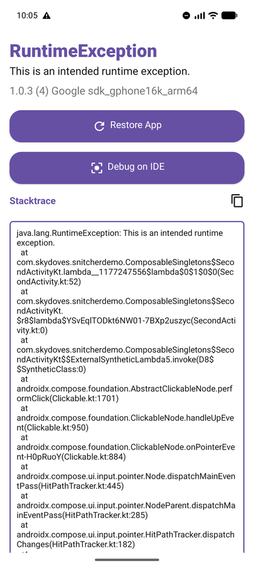
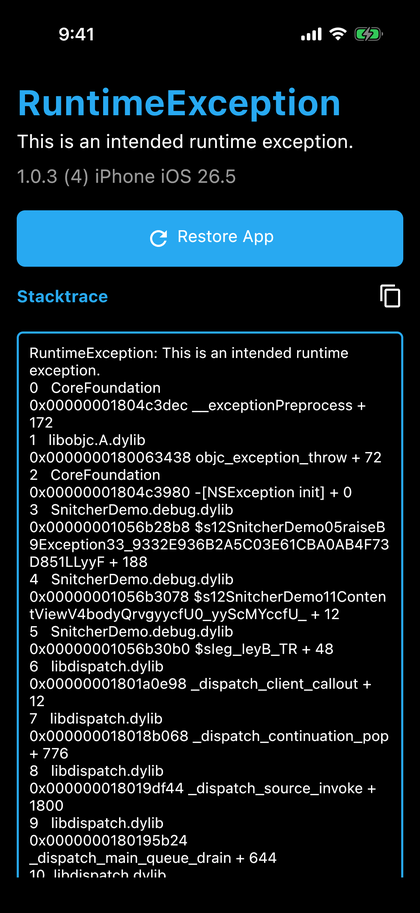
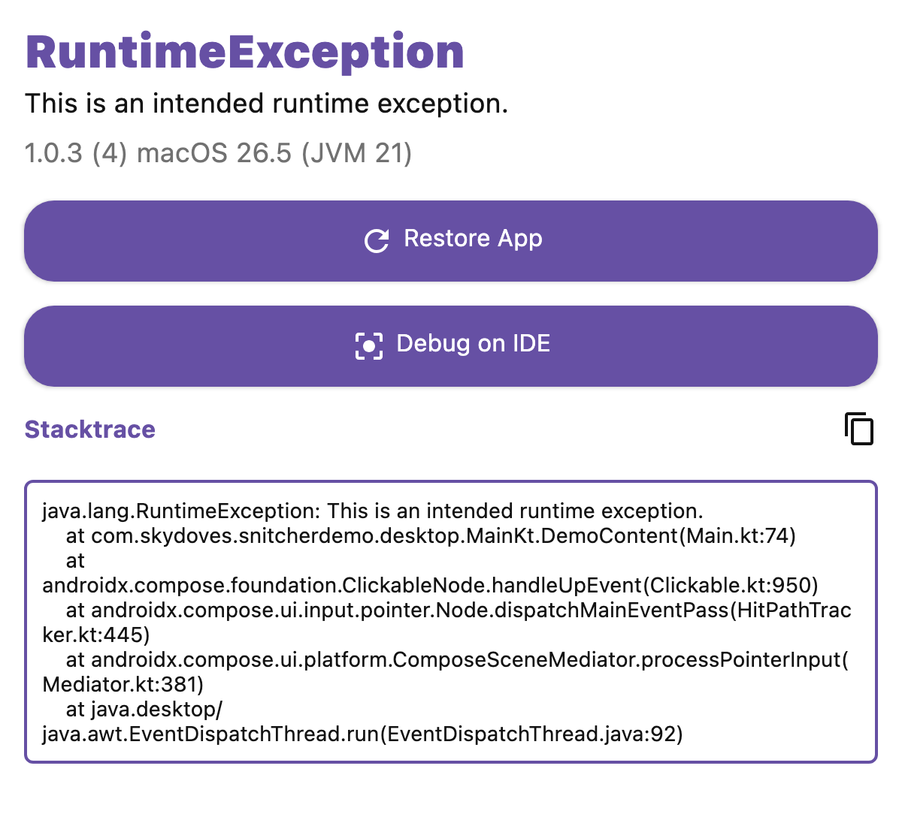

<h1 align="center">Snitcher</h1></br>

<p align="center">
  <a href="https://opensource.org/licenses/Apache-2.0"></a>
  <a href="https://android-arsenal.com/api?level=23"></a>
  <a href="https://github.com/skydoves/snitcher/actions/workflows/ci.yml"></a>
  <a href="https://github.com/skydoves"></a>
</p><br>

<p align="center">
🦉 Snitcher captures global crashes on Android, desktop, and iOS, and redirects to the exception tracing screen for swift recovery.
</p><br>

<p align="center">


</p>

<p align="center">

</p>

## What is Snitcher?

Snitcher offers versatile advantages such as aiding in debugging crashes during development, facilitating easy sharing of exceptions by your QA team, enhancing user experiences with recovery screens instead of abrupt closures, and enabling global exception tracing and customized launch behaviors tailored to your specific needs. You have the complete freedom to customize the crash tracing screens according to your build types and preferences, reporting to the Firebase's Crashlytics with displaying the exception screen, including options like launching a designated Activity, sending messages to your BroadcastReceiver, or any other desired actions.

The screens, the theme, and the captured model are shared across every platform with Compose Multiplatform, and each platform installs the crash capture that its runtime allows.

## Documentation

For comprehensive details about Snitcher, please refer to the **[complete documentation available here](https://skydoves.github.io/snitcher/)**.

## Download

[](https://search.maven.org/search?q=g:%22com.github.skydoves%22%20AND%20a:%22snitcher%22)

### Gradle

Add the dependency below to your **module**'s `build.gradle.kts` file:

```kotlin
dependencies {
    implementation("com.github.skydoves:snitcher:2.0.0")
}
```

In a multiplatform module, add it to the source set that needs it:

```kotlin
kotlin {
  sourceSets {
    commonMain.dependencies {
      implementation("com.github.skydoves:snitcher:2.0.0")
    }
  }
}
```

## What each platform can capture

| | Android | Desktop (JVM) | iOS |
| --- | --- | --- | --- |
| Uncaught JVM exceptions | yes | yes | not applicable |
| Unhandled Kotlin exceptions | yes | yes | yes |
| Uncaught `NSException` | not applicable | not applicable | yes |
| Unix signals, such as a Swift trap or a memory error | no | no | no |
| When the screen is shown | right after the crash, in a trace activity | right after the crash, in a window | on the next launch |
| Can restart the app | yes | no, the process keeps running | no, iOS does not let an app relaunch itself |

On iOS an unhandled Kotlin exception terminates the process, so the crash is recorded and displayed on the next launch. Snitcher records it and leaves the termination to the runtime, exactly as it would happen without Snitcher.

## Usage

### Android

Install Snitcher in your `Application` class. Snitcher becomes the default uncaught exception handler, persists the crash, and launches the exception tracing activity.

```kotlin
import com.skydoves.snitcher.Snitcher
import com.skydoves.snitcher.install

class App : Application() {

  override fun onCreate() {
    super.onCreate()

    Snitcher.install(application = this)
  }
}
```

`install` is an extension of the `Snitcher` object that lives in each platform source set, so it needs that import.

### Desktop

Install Snitcher before your `application { }` block, and place `SnitcherTraceWindow` next to your own window. The JVM keeps running after an uncaught exception, so the crash window opens right away.

```kotlin
fun main() {
  Snitcher.install()

  application {
    Window(onCloseRequest = ::exitApplication) {
      App()
    }

    SnitcherTraceWindow()
  }
}
```

### iOS

Install Snitcher when your app starts. The runtime terminates the process after a crash, so present the screen on the launch that follows it.

```swift
import Snitcher

@main
struct SampleApp: App {

  init() {
    Snitcher.shared.install()
  }

  var body: some Scene {
    WindowGroup { ContentView() }
  }
}
```

```swift
struct ContentView: View {

  @State private var showsCrash = Snitcher.shared.exception.value != nil

  var body: some View {
    MyContent()
      .fullScreenCover(isPresented: $showsCrash) {
        SnitcherScreen {
          Snitcher.shared.clear()
          showsCrash = false
        }
        .ignoresSafeArea()
      }
  }
}

struct SnitcherScreen: UIViewControllerRepresentable {
  let onRestore: () -> Void

  func makeUIViewController(context: Context) -> UIViewController {
    SnitcherViewControllerKt.snitcherViewController(onRestore: onRestore)
  }

  func updateUIViewController(_ uiViewController: UIViewController, context: Context) {}
}
```

The [demo-ios](demo-ios) module is a complete sample, and [demo-desktop](demo-desktop) and [demo](demo) cover the other two platforms.

### Tracing global exceptions

Every installer takes an `exceptionHandler`, which is useful to report a crash to another platform, such as [Firebase Crashlytics](https://firebase.google.com/docs/crashlytics).

```kotlin
Snitcher.install(
  application = this,
  exceptionHandler = { exception: SnitcherException ->
    Firebase.crashlytics.log(exception.stackTrace)
  },
)
```

`SnitcherException` carries the exception name, the message, the whole stack trace, and the thread information. On Android and on the desktop you can restore the original throwable with `SnitcherException.toThrowable()`.

### Launcher (restore) Activity

On Android you can decide which Activity is launched when the user restores the app. Without it, the most recent Activity before the crash is used.

```kotlin
Snitcher.install(
  application = this,
  launcher = MainActivity::class,
)
```

### Custom Snitcher Theme

The pre-built screens are styled by a `SnitcherThemeConfig`. Give one to the installer, and the pre-built screens, as well as every screen you wrap in `SnitcherTheme`, will be drawn with it:

```kotlin
Snitcher.install(
  application = this,
  theme = SnitcherThemeConfig(
    lightColors = SnitcherColor.defaultColors().copy(primary = Color(0xFF6650a4)),
    darkColors = SnitcherColor.defaultDarkColors().copy(primary = Color(0xFFD0BCFF)),
    typography = SnitcherTypography.defaultTypography().copy(
      title = TextStyle(fontSize = 30.sp, fontWeight = FontWeight.Black),
    ),
    shapes = SnitcherShapes(button = RoundedCornerShape(20.dp)),
  ),
)
```

Colors left unspecified follow the color they belong to, so `copy(primary = Color.Red)` restyles the title, the labels, the buttons, and the stack trace border together.

### Custom texts

The texts of the pre-built screens are plain strings, so they travel across platforms and you can translate them:

```kotlin
Snitcher.install(
  application = this,
  strings = SnitcherStrings(
    traceRestoreButton = "다시 시작",
    traceStacktrace = "스택트레이스",
  ),
)
```

### Custom trace screens

`ExceptionTraceScreen` and `AppRestoreScreen` are plain composables, so you can build your own screen around the state that Snitcher publishes:

```kotlin
val exception by Snitcher.exception.collectAsState()

SnitcherTheme {
  exception?.let {
    ExceptionTraceScreen(
      snitcherException = it,
      onRestore = { /* restore your app */ },
    )
  }
}
```

## Migrating from 1.0.x

- `Snitcher.install(..)` is a platform extension now, so add `import com.skydoves.snitcher.install`
- The texts moved from `values/strings.xml` to `SnitcherStrings`, which the installer takes. Locale
  specific `values-xx` overrides of the `snitcher_*` strings no longer apply
- `SnitcherException.throwable` became `SnitcherException.toThrowable()`, on Android and desktop
- `SnitcherException` is no longer `java.io.Serializable`, and `SnitcherInstaller` is gone
- The crash is stored in a plain file rather than in DataStore, so a crash written by 1.0.x is
  not read back after the update

## Find this repository useful? :heart:
Support it by joining __[stargazers](https://github.com/skydoves/snitcher/stargazers)__ for this repository. :star: <br>
Also, __[follow me](https://github.com/skydoves)__ on GitHub for my next creations! 🤩

# License
```xml
Designed and developed by 2023 skydoves (Jaewoong Eum)

Licensed under the Apache License, Version 2.0 (the "License");
you may not use this file except in compliance with the License.
You may obtain a copy of the License at

    http://www.apache.org/licenses/LICENSE-2.0

Unless required by applicable law or agreed to in writing, software
distributed under the License is distributed on an "AS IS" BASIS,
WITHOUT WARRANTIES OR CONDITIONS OF ANY KIND, either express or implied.
See the License for the specific language governing permissions and
limitations under the License.
```
